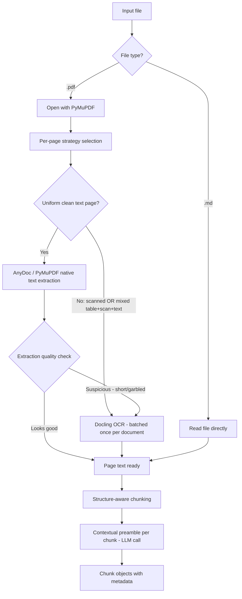
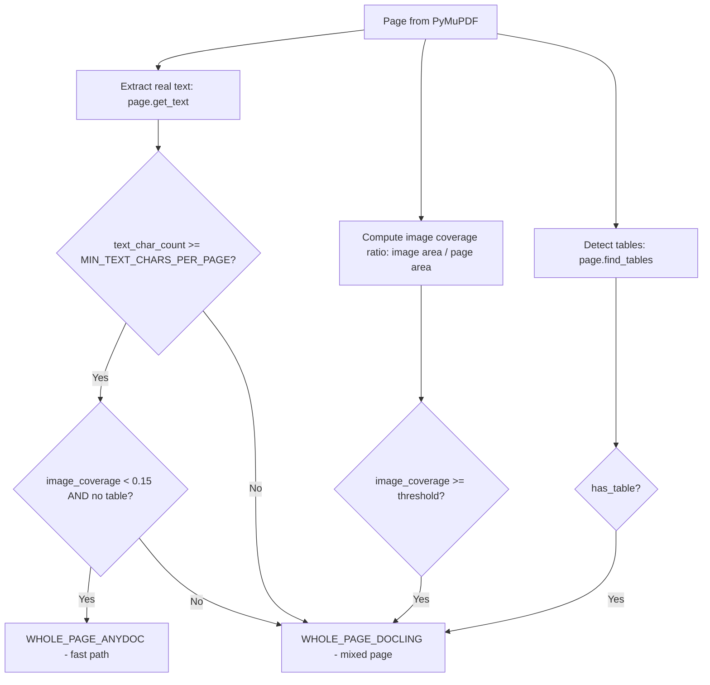
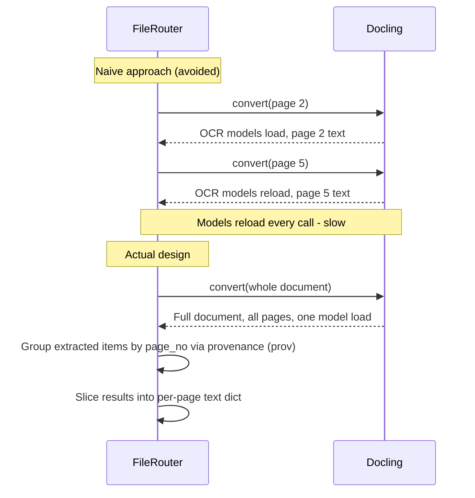
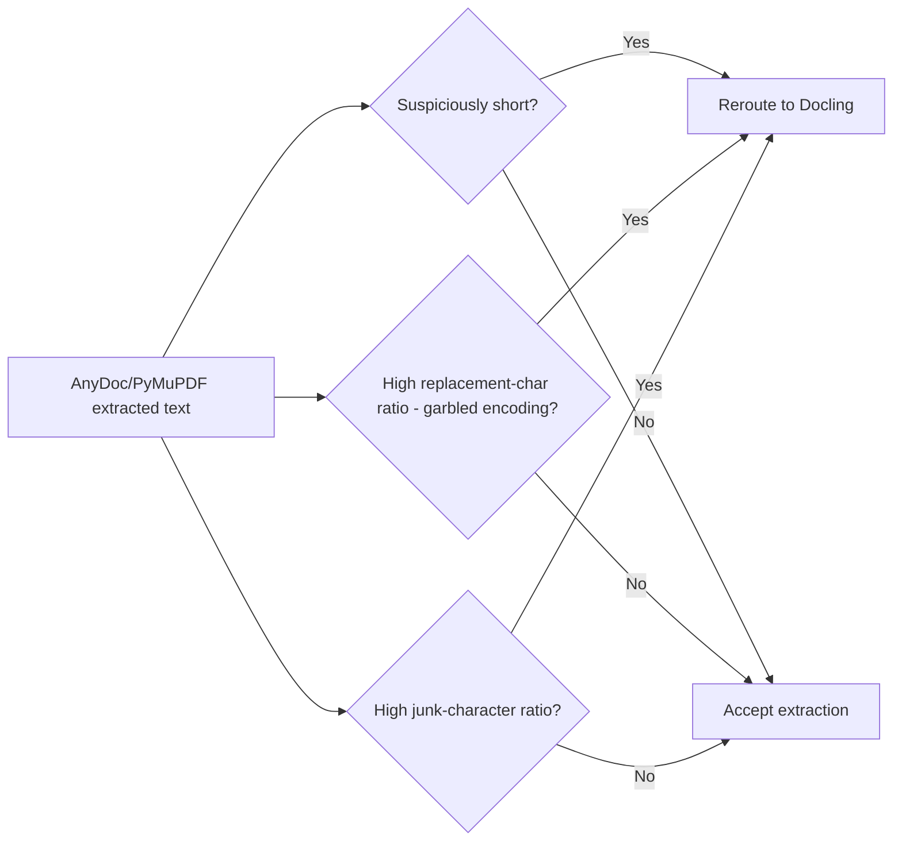
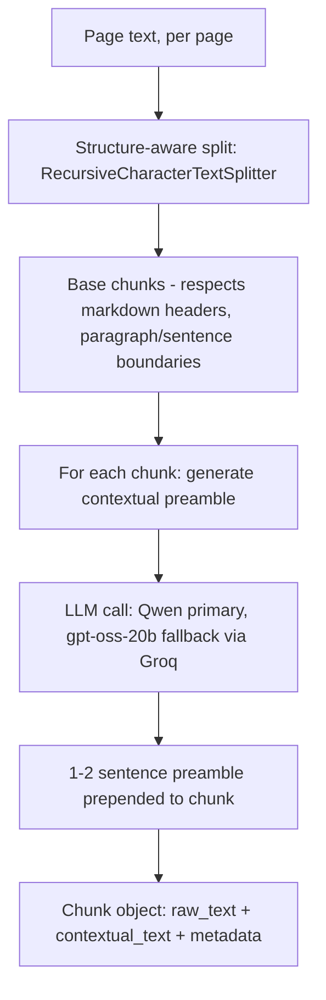

# Ingestion Module — System Design

## Why this module exists

The agentic RAG harness needs clean, structured text before anything else (chunking,
embedding, retrieval) can work. Source files are messy in different ways depending on
type:

- **PDFs** may be native text, fully scanned images, or a mix of text + tables + scanned
  content on the same page.
- **Markdown** files are already structured plain text — no ambiguity, no scanning
  problem.

A single extraction method can't handle all of this well. Native-text PDFs need fast,
accurate structural extraction. Scanned or visually mixed pages need OCR. Using OCR
everywhere is slow and can introduce transcription errors into text that was already
clean. Using plain text extraction everywhere silently loses scanned/table content.
So the module's core job is **deciding, per page, which extraction path a page needs,
then running the right tool** — rather than picking one tool for the whole document.

---

## High-level flow

---

## Why per-page routing, not per-file

For PDFs specifically, the unit of decision is the **page**, not the file. A single
PDF can have page 1 as clean native text, page 2 fully scanned, and page 3 a mix of
text, a table, and a scanned stamp/signature. Routing the whole file to one tool means
either:

- Running OCR on already-clean text (slower, and OCR can introduce errors into text
  that didn't need touching), or
- Running plain extraction on scanned pages (silently returns nothing, since there's
  no text layer to extract).

Per-page routing avoids both failure modes.

For every other format (docx, pptx, xlsx, csv, epub, rtf, and our supported `.md`),
there's no such split — the whole file goes through one path, because those formats
don't have a "might secretly be a scanned image" problem; they're always structured
text internally.

---

## Page classification logic

**Why these specific signals, and not an ML classifier:**

- `text_char_count` and image coverage are read directly from the PDF's internal
  object structure (real embedded text operators, real image bounding boxes) — not
  guessed from rendered pixels. This makes the check fast (milliseconds, no rendering)
  and deterministic.
- `find_tables()` catches a case the other two signals miss: a page can have plenty of
  real text *and* low image coverage, yet still contain a table whose structure would
  be lost or garbled by naive text extraction. Any detected table sends the whole page
  to Docling, which has table-structure recognition.
- The three checks are deliberately conservative (fail toward Docling) because sending
  a clean page to Docling costs some extra time; sending a scanned/table page to
  AnyDoc/plain-text silently loses content. The asymmetry in failure cost is why the
  logic is "if in doubt, OCR it," not "if in doubt, skip OCR."

---

## Why AnyDoc for clean pages

AnyDoc's PDF path is structural (`pdf-inspector`-based) — it reads what's actually
embedded in the PDF rather than rendering and re-reading pixels. For a page that's
confirmed uniform clean text, this is:

- **Fast** — no OCR model inference needed.
- **Accurate** — no OCR transcription risk on text that was already machine-readable.

In this implementation, uniform-text pages use PyMuPDF's own `page.get_text("text")`
directly rather than round-tripping through AnyDoc's file-level converter — because
AnyDoc converts whole documents, not arbitrary already-extracted strings, and
PyMuPDF's structural text extraction is the same category of signal AnyDoc's own PDF
path relies on internally. This avoids an unnecessary extra conversion step for a
single already-isolated page's text.

---

## Why Docling for scanned/mixed pages, and why batched once per document

Docling does real OCR (via RapidOCR under the hood) and has table-structure
recognition — this is the tool for anything a plain text extraction can't reliably
read.

**Critical design point: Docling runs once per document, not once per flagged page.**

Docling's `.convert()` call loads its OCR model weights as part of running. Calling it
once per flagged page means reloading/re-running that setup on every call — for a
document with several scanned/mixed pages, this compounds into real, avoidable
latency. Running it once for the whole document and then grouping the output by each
element's page-number provenance (`item.prov[i].page_no`) gets the same per-page
result at a fraction of the cost.

---

## Post-extraction quality gate

**Why this exists:** the upfront page classifier is a structural heuristic, not a
guarantee. Two known failure modes it can miss:

1. A page can have a "text layer" that's technically present but decodes to garbage
   (custom/broken font encodings from some PDF generators).
2. A page might already have a poor-quality OCR text layer baked in from a previous
   OCR pass — the classifier sees "text exists" and trusts it, even if that text is
   bad.

This gate catches both by inspecting the *output* of extraction, not just the *input*
signals — if the result looks broken (too short, full of `�` replacement characters,
high ratio of non-linguistic junk), the page is rerouted to Docling as a second
attempt, rather than silently shipping bad text downstream.

---

## Chunking and contextual preambles

**Why structure-aware splitting, not fixed character slicing:** a raw character-count
cut can sever a sentence or clause mid-way (e.g. splitting "penalty applies unless
paid within 15 days" across two chunks), which breaks both keyword search and the
contextual-preamble step, since the preamble is summarizing an already-broken unit of
meaning. `RecursiveCharacterTextSplitter` tries paragraph breaks, then sentence
breaks, then word breaks, only falling back to a hard character cut as a last resort —
so chunks stay semantically coherent.

**Why a contextual preamble per chunk:** a chunk in isolation often loses the context
that made it findable — e.g. "revenue increased by 12% this quarter" doesn't mention
the company or date, so a query like "what was ACME Corp's Q3 growth" might not match
it well semantically. A short LLM-generated preamble situates the chunk (entities,
topic, dates) before embedding, without polluting the chunk's *metadata* fields (which
stay separate and structured for filtering/citation).

**Why Qwen as primary, not a reasoning model:** this is a cheap, high-volume,
low-stakes task (1-2 sentences, temperature 0). A reasoning model burns tokens on
internal "thinking" before producing the actual answer, which is wasted cost for a
task this simple — a plain instruct model is faster and cheaper with no quality loss
here. The reasoning model (`gpt-oss-20b`) is kept as a fallback path only, in case the
primary model is rate-limited or unavailable.

---

## Function reference

| Function / Class | Responsibility |
|---|---|
| `PDFPageStrategySelector.select_strategy` | Decides per page: `WHOLE_PAGE_ANYDOC` or `WHOLE_PAGE_DOCLING`, using text presence, image coverage, and table detection |
| `PDFPageStrategySelector._compute_image_coverage` | Real PyMuPDF signal: sum of embedded image bounding-box areas / page area |
| `PDFPageStrategySelector._has_table` | Real PyMuPDF signal: ruling-line-based table detection |
| `FileRouter.ingest_file` | Entry point; dispatches by file extension (`.pdf` vs `.md`) |
| `FileRouter._ingest_pdf` | Runs strategy selection for every page, batches Docling once if any page needs it, extracts each page via the chosen path |
| `FileRouter._extract_whole_pages_with_docling` | Single Docling `.convert()` call per document; groups extracted text by page via `item.prov[].page_no` |
| `FileRouter._ingest_md` | Reads `.md` files directly — no classification needed |
| `ExtractionQualityChecker.is_extraction_suspicious` | Post-extraction gate: flags too-short, garbled, or junk-heavy output for reroute to Docling |
| `IngestionRoutingLog.log_strategy` | Audit trail — every routing decision logged with page, chosen route, and reason, so misroutes are debuggable rather than silent |
| `StructureAwareChunker.split` | Markdown-header-aware, then recursive paragraph/sentence-aware text splitting |
| `ContextualChunker.generate_context_preamble` | LLM call producing a 1-2 sentence situating preamble per chunk (whole-doc or windowed context depending on document length) |
| `ContextualChunker.chunk_document` | Orchestrates split + preamble generation into final `Chunk` objects with metadata |
| `GroqFallbackClient.generate` | Retries primary model, switches to fallback model after retries are exhausted (e.g. on rate limits) |

---

## Design principle underlying all of the above

Every routing and quality decision here is made by **code checking real, verifiable
signals** (text char counts, image coverage ratios, table detection, output-length/
garbage-ratio checks) — never by asking a model to self-report whether it did a good
job. The LLM is only used where judgment about *meaning* is genuinely required (the
contextual preamble); everything else that can be checked deterministically, is.
