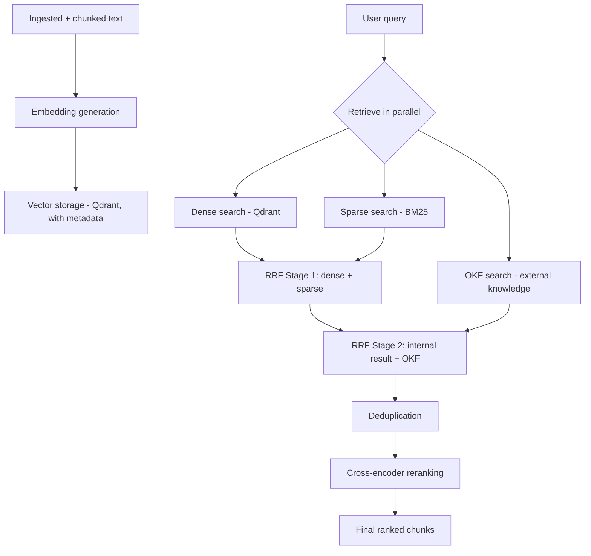
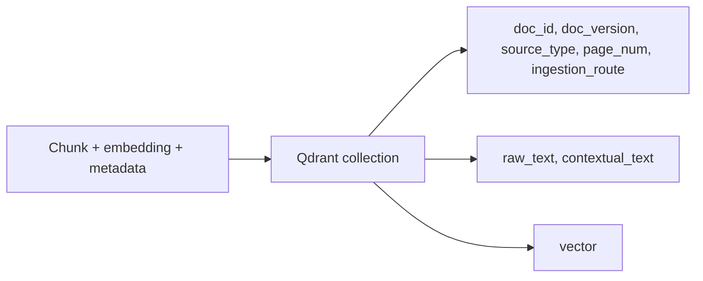
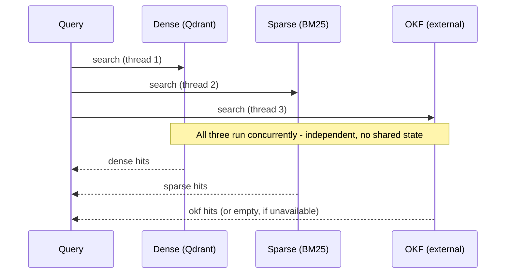
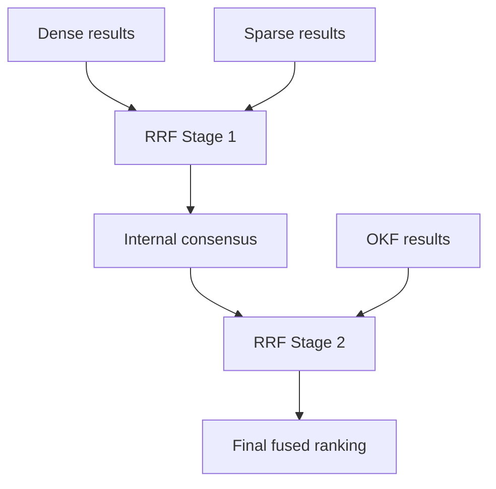

# Retrieval Layer — System Design

*(Covers everything built after ingestion: embedding generation, vector storage,
and the dense + sparse + OKF retrieval pipeline with fusion, dedup, and reranking.)*

## Why this layer exists

Ingestion produces clean, chunked text with a contextual preamble. On its own, that
text is not searchable — nothing yet turns a chunk into something a query can be
matched against, and nothing yet decides *which* chunks are relevant to a given
question. This layer does three things in sequence: turn chunks into vectors,
store those vectors (with their metadata) somewhere queryable, and then, at query
time, find and rank the chunks that actually answer the question — combining
multiple independent retrieval signals rather than trusting just one.

---

## High-level flow

---

## Embedding generation

**Why a primary + fallback model pair, not just one model:** any single model can
fail to load (network issue, corrupted cache, out-of-memory) or fail mid-batch
during a long ingestion run. Rather than let the whole pipeline crash, a fallback
model takes over for the rest of the session once the primary fails, and stays
active rather than re-attempting a known-broken primary on every subsequent call.

**Why the fallback must share the primary's vector dimension:** every chunk in a
Qdrant collection must have the same-length vector to be comparable. If primary and
fallback produced different-sized vectors, switching mid-session would either break
storage outright or silently corrupt similarity search (comparing vectors of
mismatched meaning at the same dimension). The primary/fallback pair used here
(BGE-base-en-v1.5 and all-mpnet-base-v2) was chosen specifically because both
produce 768-dimensional vectors — the fallback is a genuine safety net, not a
liability.

**Why a different model family for the fallback, not the same family at a smaller
size:** if primary and fallback shared an underlying architecture or weights
lineage, a systemic issue (e.g. a broken download mirror for that model family)
could take out both at once. Using an unrelated model family means the fallback's
failure modes are independent of the primary's.

**What gets embedded:** each chunk's `contextual_text` (raw text plus its LLM-
generated situating preamble from the chunking step), not the raw text alone — the
preamble is specifically there to improve how well the embedding captures what the
chunk is about, so leaving it out at embedding time would waste that earlier work.

---

## Vector storage

**Why Qdrant specifically:** it stores a vector and its structured metadata
together as one point, and supports filtering on that metadata during search — so
retrieval isn't limited to "find similar vectors," it can also be narrowed by
document, version, or page when that's useful later.

**Why environment-aware path selection:** the same code needs to run unmodified
whether it's executing in Colab or a local machine (e.g. VS Code). Embedded/local
Qdrant just needs a directory to write to — detecting the environment and pointing
at the right default path means no manual editing when moving between the two.

**Why embedded/local mode is a development choice, not a production one:**
embedded mode locks its storage directory to a single process. That's fine for one
person testing in one notebook, but it breaks the moment more than one process
needs to read or write the same data (e.g. an ingestion job and a separate query
service running side by side). Production needs a real Qdrant server, which
supports concurrent clients natively — the client code barely changes (a URL
instead of a path), but the operational model does.

**Why store `raw_text` alongside `contextual_text`:** the contextual version is what
gets embedded and searched, but the raw version is what should actually be shown
back to a user or cited — the preamble is a search aid, not part of the source
document, so keeping both avoids ever presenting fabricated-sounding context as if
it were the original text.

---

## Retrieval: three independent sources, run in parallel

**Why three sources instead of one:** each catches things the others miss.

- **Dense (semantic) search** finds chunks that mean the same thing as the query
  even when the wording differs — good for paraphrased or conceptual questions.
- **Sparse (BM25/keyword) search** finds exact terms — critical for fintech/legal
  text full of specific clause numbers, defined terms, and exact phrases that
  semantic search can under-weight.
- **OKF (external knowledge)** supplements the internal corpus with outside
  information the ingested documents don't contain at all.

Relying on only one would systematically miss whatever that method is weak at.

**Why run them in parallel, not sequentially:** the three searches don't depend on
each other's results — sequential execution would mean paying the sum of all three
latencies instead of the maximum of the three. Running them concurrently (via a
thread pool) means the total wait time is roughly however long the slowest one
takes, not the sum of all three.

**Why OKF degrades to an empty result instead of failing the whole query:** OKF is
a secondary, supplementary signal, not a required one. If it errors or is
unavailable, the query should still succeed using the two sources that are actually
part of the owned corpus — a failure in an optional enrichment step should never
take down the core retrieval path.

---

## Fusion: why two-stage RRF, not one flat merge

**Why Reciprocal Rank Fusion at all, rather than combining raw similarity scores:**
dense similarity scores, BM25 scores, and OKF's own scoring are all on different,
incomparable numeric scales — a "0.8" from one method doesn't mean the same thing
as a "0.8" from another. RRF sidesteps this entirely by using each result's *rank
position* within its own list rather than its raw score, so results from
differently-scaled sources can be combined fairly.

**Why two stages instead of fusing all three sources at once:** this is a
deliberate design choice, not an accident of pipeline order. Dense and sparse
search both run against the same owned, trusted corpus — fusing them first
produces an "internal consensus" that reflects genuine agreement within the
documents actually ingested. OKF is external and not vetted the same way, so it is
fused *against* that already-formed internal consensus in a second pass, rather
than as an equal third voter from the start. This means OKF can help fill gaps or
add supporting detail, but a single external hit can't outrank strong agreement
between dense and sparse search on the owned corpus. This matters specifically in a
compliance-sensitive context (fintech/lending), where the internal, source-of-truth
documents should carry more weight than an external knowledge source by default.

---

## Deduplication

**Why deduplicate after fusion, before reranking:** without it, several
near-identical chunks (e.g. overlapping text pulled in separately by dense and
sparse search) could occupy multiple slots in the final result set, crowding out
genuinely different information. Reranking is the most computationally expensive
step in the pipeline (a cross-encoder scores every query-chunk pair individually),
so removing duplicates *before* that step means the expensive step isn't wasted on
redundant content — it's both a quality fix and an efficiency one.

**Why embedding-similarity-based dedup, not exact text matching:** two chunks can
be near-duplicates without being byte-identical (slightly different chunk
boundaries capturing mostly the same sentence, for instance). Comparing embeddings
against a similarity threshold catches this; exact string matching would not.

---

## Reranking

**Why a separate reranking step after retrieval, rather than trusting the fused
ranking as final:** the retrieval methods (dense embedding similarity, BM25, RRF
fusion) are all optimized to be fast enough to search a large corpus, which means
they trade off some precision for speed. A cross-encoder reranker directly scores
the actual query text against each candidate chunk's actual text, which is far more
accurate at judging true relevance — but too slow to run against an entire corpus.
Running it only on the smaller, already-fused-and-deduplicated candidate set gets
the best of both: fast narrowing first, precise judgment last, on a small enough
set that the precision step stays affordable.

---

## Design principle carried through this layer

Every fusion, dedup, and ranking decision here is based on **explicit, checkable
signals** — rank position, embedding similarity thresholds, direct query-chunk
scoring — not on any single method's raw confidence being taken at face value.
Combining multiple independent, differently-flawed methods (dense, sparse, OKF)
and reconciling them through a principled process (two-stage RRF, threshold-based
dedup, cross-encoder rerank) produces a more reliable final ranking than trusting
any one method alone — the same "don't trust self-report, check it" principle
that governs the harness's verification layer later in the pipeline.

---

## What's intentionally deferred, and why

**Metadata pre-filtering** (narrowing the search space by document section or
category before running retrieval) was considered and deliberately postponed. It
adds real cost — at minimum an extra embedding/BM25 comparison step, potentially an
LLM call to decide which category a query belongs to — and only pays for itself
once the corpus is large enough that ruling out a large fraction of it in advance
meaningfully speeds up search. At the current small scale, that overhead would cost
more than it saves. This is a "build when the scale justifies it" decision, not a
permanent exclusion — the ingestion metadata schema (`doc_id`, `page_num`,
`section_title`, etc.) already carries what pre-filtering would eventually need.
