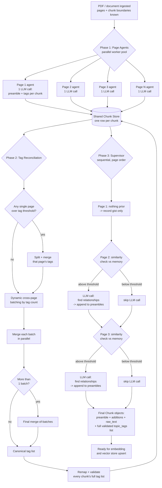

# Page-Level Contextual Tagging & Preamble Pipeline — Design Doc

## 0. The two core questions this feature answers

Everything in this pipeline traces back to two specific questions we needed a real answer for:

1. **"Can one chunk belong to multiple topics?"**
   → Solved by **multi-tag storage**. `ChunkMetadata.topic_tag` (a single string) was changed to `topic_tags` (a list), and the code that was silently collapsing every chunk down to just its first tag (`row["tags"][0]`) was fixed to keep the full validated list instead.

2. **"Do different chunks that cover the SAME topic use the SAME tag name?"**
   → Solved by **tag merging / reconciliation**. The hierarchical merge step (within-page split + cross-page batching + final merge) collapses differently-worded tags — e.g. `tool_code`, `code_execution_tool`, `tools_for_coding` — into one canonical name. A rename map ensures a chunk that originally used an old wording still correctly resolves to the new canonical tag instead of being silently dropped during validation.

Everything else in this document — the page-level agents, the supervisor, the thresholds — exists in service of answering these two questions correctly and efficiently.

## 1. Why this exists

The original chunking pipeline generated a preamble for every chunk in isolation (only seeing its immediate neighbor chunks), and proposed topic tags once for the whole document in a single call. This caused two real problems:

- **Weak preambles** — a chunk-only or neighbor-only view meant the LLM couldn't situate a chunk within the bigger picture of its page.
- **Tag drift** — different LLM calls (across chunks or across documents) would invent slightly different wording for the same concept (e.g. `tool_code`, `code_execution_tool`, `tools_for_coding`), making metadata filtering unreliable.

This pipeline redesigns tagging and preamble generation around **one LLM call per page** (not per chunk), with a separate reconciliation phase that removes tag drift, and a lightweight "supervisor" phase that adds cross-page context where it genuinely helps.

## 2. overview

Think of it as three people doing three different jobs, in this order:

1. **Page readers (parallel).** Several page readers work at the same time, each reading one full page of the document. Each one writes a short note ("preamble") for every paragraph-sized chunk on their page, and labels each chunk with topic tags — plus a one-sentence reason for each tag, so we know *why* it was chosen.

2. **An editor (tag cleanup).** Once all the page readers are done, an editor looks at every tag every reader proposed. Readers working independently often name the same idea differently (`react_pattern` vs `reasoning_action_loop`). The editor merges these into one clean, agreed-upon list of topic names, and remembers which original wording maps to which final name — so nothing gets lost in the cleanup, just renamed.

3. **A supervisor (cross-page linking).** Finally, a supervisor walks through the pages in order — page 1, then 2, then 3 — checking whether anything on the current page meaningfully connects to something from an earlier page. If page 3 builds directly on an idea from page 1, the supervisor adds one sentence noting that connection to page 3's chunk preamble. If nothing relates, the supervisor does nothing — it doesn't force connections that aren't really there, and it only bothers checking when a cheap, free similarity check suggests it's worth a closer (paid) look.

The result: every chunk ends up with a preamble that reflects its whole page's context (not just its own sentence), sometimes enriched with a note about how it connects to earlier pages, and a clean set of validated tags that are safe to filter by.

## 3. The full algorithm

### Phase 1 — Page Agents (parallel)

```
INPUT: pages = [{page_num, text, chunk_boundaries}, ...]   # boundaries already
                                                              # computed by the
                                                              # existing chunker

for each page, dispatched concurrently across a worker pool:
    one LLM call, given:
      - the full page text
      - the list of known chunk_ids + their text on this page
    returns, per chunk:
      - a preamble (1-2 sentences, grounded in the full page)
      - proposed tags, each with a one-sentence reason

    -> written immediately into a shared per-chunk store as soon as
       that page's call finishes (no waiting for other pages)
```

### Phase 2 — Hierarchical Tag Reconciliation

```
STEP A — within-page split (only if one page alone produces too many tags):
    if a single page's tag count > WITHIN_PAGE_SPLIT_THRESHOLD:
        split that page's tags into smaller groups
        merge each group in parallel
        merge those results together -> that page's tags are now compact

STEP B — cross-page dynamic batching:
    walk all pages in order, grouping them into batches such that each
    batch's TOTAL tag count stays under PAGE_BATCH_THRESHOLD
    (a page with an unusually large tag count becomes its own batch)

STEP C — merge each batch in parallel:
    for each batch, one LLM call merges near-duplicate tags into
    canonical names, and reports which original tag strings were
    "absorbed" into each canonical name (the rename map)

STEP D — final merge (only if more than one batch exists):
    one more LLM call merges the batch-level results into the final,
    document-wide canonical tag list

STEP E — remap and validate every chunk's tags:
    for every chunk, translate its originally-proposed tags through
    the rename map, keep only tags that map to something in the
    canonical list, keep the FULL resulting list (a chunk can
    legitimately have more than one topic)
```

### Phase 3 — Supervisor Pass (sequential, page order)

```
running_memory = []   # small list of condensed "gists", one per page seen so far

for page_num in sorted(pages):
    gist = short summary of this page's tags (cheap, no LLM call)

    similarity = cosine similarity between this page's gist embedding
                 and every embedding already in running_memory
                 (cheap — uses the embedding model already in the
                 pipeline, no LLM call)

    if similarity >= SUPERVISOR_SIMILARITY_THRESHOLD:
        one LLM call: "does anything on this page relate to earlier
        pages (summarized in running_memory)?"
        -> append any returned relationship sentences to the
           relevant chunks' preambles (append-only — the original
           preamble is never overwritten)
    else:
        skip the LLM call entirely — most pages will land here

    add this page's gist to running_memory for the next page's check
```

### Final assembly

```
for every chunk in the shared store:
    contextual_text = preamble_base + any supervisor additions + raw_text
    build the final Chunk object with:
        - raw_text
        - contextual_text
        - metadata.topic_tags = the full validated tag list (not just one)
```

## 4. Mermaid flow diagram



## 5. Tunable parameters

| Parameter | What it controls | Starting value | Notes |
|---|---|---|---|
| `WITHIN_PAGE_SPLIT_THRESHOLD` | Max tags from ONE page before it gets split and merged internally | 40 | Raise if a single page rarely produces this many tags; lower if merge quality seems to degrade on dense pages |
| `PAGE_BATCH_THRESHOLD` | Max total tags allowed in one cross-page merge call | 20 | Lower = more, smaller merge calls (safer, slower); higher = fewer, bigger calls (cheaper, riskier for dedup accuracy) |
| `SUPERVISOR_SIMILARITY_THRESHOLD` | Cosine similarity cutoff that decides whether the supervisor bothers making an LLM call for a page | 0.55 | Lower = supervisor fires more often (more cross-page links found, more LLM calls); higher = fires less often (fewer calls, may miss subtler relationships) |
| `PAGE_WORKER_COUNT` | Number of page agents allowed to run concurrently | 4 | Bounded by your LLM provider's rate limits, not by document size |

**How to tune them in practice:** start at the defaults above, run on a real multi-page document, and check two things — (1) does the canonical tag list have any obvious near-duplicates that should have merged? If so, lower `PAGE_BATCH_THRESHOLD`. (2) Does the supervisor seem to be missing connections you'd expect it to catch, or firing too often on unrelated pages? Adjust `SUPERVISOR_SIMILARITY_THRESHOLD` up or down accordingly.

## 6. LLM call cost, worst case vs. best case (10-page, 20-chunk document)

| Step | Best case | Worst case |
|---|---|---|
| Page agents | 10 | 10 |
| Within-page splits | 0 | ~3 (one page overflows) |
| Cross-page batch merges | 1 | ~5 |
| Final merge-of-batches | 0 | 1 |
| Supervisor passes | 0 (nothing relates across pages) | 9 (every page relates to something prior) |
| **Total** | **~11** | **~27–31** |

Compare to the original per-chunk design on the same document: 1 whole-doc tag call + 20 per-chunk preamble calls = **21 calls**, with weaker cross-page awareness and no tag-drift protection.
